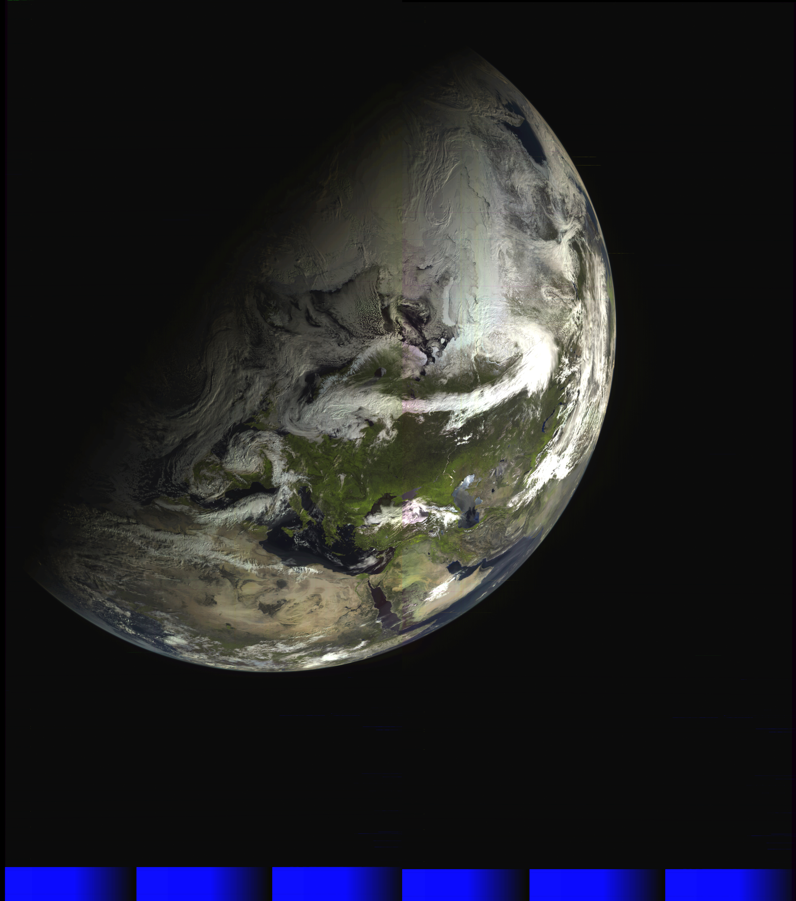

Aligns RDAS channels in order to be processable using SatDump to make proper composites without the 3D blur effect

To compile:
```sh
git clone https://github.com/Digitelektro/rdas_layer_aligner/
cd rdas_layer_aligner

mkdir build && cd build
cmake ..
make -j`nproc`

# Symlink config to use precalculated calibration:
ln -s ../config.json config.json
```

Usage:

```
# If you are decding L4 or just want get your own calibration coefficients (calibration is already included for L2/L3/M1/M2):
./rdas_layer_aligner -s <sat: L2|L3|L4|M1|M2> -d <live-output-directory> -m calibrate
# e.g. ./rdas_layer_aligner -s L2 -d 2025-01-02_12-34_elektro-rdas -m calibrate
# Note that this doesn't create merge parameters as they have to be manually adjusted.

# To generate aligned products:
./rdas_layer_aligner -s <sat: L2|L3|L4|M1|M2> -d <live-output-directory> -m generate
# e.g. ./rdas_layer_aligner -s L2 -d 2025-01-02_12-34_elektro-rdas -m generate

# Optionally you can use this to output an NC as well by adding the -n switch with the name of the NC image. That spits out an RGB321.

# Optionally you can use the generated cbor to load the result back to satdump 

```

## Example outputs

### Elektro L3


### Elektro L2


### Arktika-M2

